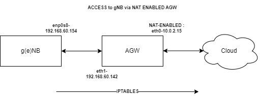

# Radio (g/eNB) connectivity via AGW

## Connectivty with NAT enabled

### Configuration


* Only one direction (towards internet)configuration is required
* Reverse direction already taken care

### Commands
- sudo iptables -I FORWARD 1 -i eth1 -o eth0 -p tcp  -s 192.168.60.154 --dport 443 -j ACCEPT
- sudo iptables -A POSTROUTING -t nat -o eth0 -p tcp --dport 443 -s 192.168.60.154 -j MASQUERADE

### Verification

* On g(e)NB Machine execute following steps

- nslookup www.example.com -> 93.184.216.34
- sudo ip route add 93.184.216.34/32 via  192.168.60.142 dev enp0s8
- curl --interface 192.168.60.154 https://www.example.com/
```
vagrant@oai-gnb-ue-sim:~$ curl --interface 192.168.60.154 https://www.example.com/
<!doctype html>
<html>
<head>
    <title>Example Domain</title>

    <meta charset="utf-8" />
    <meta http-equiv="Content-type" content="text/html; charset=utf-8" />
    <meta name="viewport" content="width=device-width, initial-scale=1" />
    <style type="text/css">
    body {
        background-color: #f0f0f2;
        margin: 0;
        padding: 0;
        font-family: -apple-system, system-ui, BlinkMacSystemFont, "Segoe UI", "Open Sans", "Helvetica Neue", Helvetica, Arial, sans-serif;

    }
    div {
        width: 600px;
        margin: 5em auto;
        padding: 2em;
        background-color: #fdfdff;
        border-radius: 0.5em;
        box-shadow: 2px 3px 7px 2px rgba(0,0,0,0.02);
    }
    a:link, a:visited {
        color: #38488f;
        text-decoration: none;
    }
    @media (max-width: 700px) {
        div {
            margin: 0 auto;
            width: auto;
        }
    }
    </style>
</head>

<body>
<div>
    <h1>Example Domain</h1>
    <p>This domain is for use in illustrative examples in documents. You may use this
    domain in literature without prior coordination or asking for permission.</p>
    <p><a href="https://www.iana.org/domains/example">More information...</a></p>
</div>
</body>
</html>
vagrant@oai-gnb-ue-sim:~$
```
